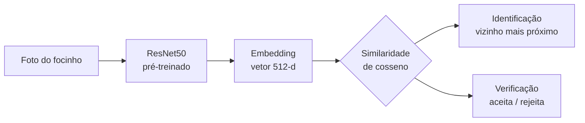

<h1 align="center">🐮 Biometria Bovina</h1>

<p align="center">
  <b>Identificação individual de bovinos pelo padrão do focinho</b><br>
  <i>re-identificação de conjunto aberto com metric learning (CNN + ArcFace)</i>
</p>

<p align="center">
  
  
  
  
</p>

---

## Visão geral

O padrão de rugas do focinho bovino é **único e estável ao longo da vida** — funciona como uma
impressão digital. Este projeto usa esse padrão para **identificar cada animal individualmente a
partir de uma foto**, sem brinco (que cai, é trocado e pode ser falsificado).

**Por que importa:** a identificação individual do rebanho é uma exigência regulatória em avanço no
Brasil e uma base para operações de **gado como garantia de crédito**, onde o credor precisa provar
que o animal existe e é aquele mesmo.

## Resultados

Avaliação em **67 animais que o modelo nunca viu no treino** (identidades disjuntas):

#### Identificação — *"qual boi é esse?"*
| métrica | valor |
|---|---|
| **Rank-1 accuracy** | **99,5%** |
| Rank-5 accuracy | 100% |
| mAP | 93,9% |

#### Verificação — *"é o boi X mesmo?"* (FAR — taxa de falsa aceitação)
| fotos cadastradas por animal | FAR @ FRR 1% |
|---|---|
| 1 foto | 34% |
| **3 fotos** | **0,8%** ✅ |
| 5 fotos | 0,2% |

> **A descoberta central do projeto:** o gargalo da verificação não era o modelo, era o **protocolo**.
> Comparar 1 foto contra 1 foto é o cenário mais severo possível. Cadastrando **3–5 fotos por animal**
> (como o desbloqueio facial do celular), a taxa de aceitar um impostor cai para **abaixo de 1%** —
> grau de garantia bancária.

## Como funciona



Cada foto é convertida pela rede num **vetor de 512 números** (o *embedding*). Fotos do mesmo animal
formam um agrupamento apertado nesse espaço; animais diferentes ficam distantes. Identificar é
comparar vetores por **similaridade de cosseno** — não há camada de classificação no fim.

## Por que metric learning + ArcFace

A decisão de projeto mais importante:

- **Não é classificação.** Um classificador tem número **fixo** de saídas — mas animais novos entram
  no rebanho o tempo todo. Seria preciso re-treinar a cada animal. A tarefa correta é
  **re-identificação de conjunto aberto**: aprender um espaço de embeddings que generaliza para
  identidades nunca vistas.
- **ArcFace** (*Additive Angular Margin Loss*) treina de forma estável — como classificação, usando
  todos os dados em cada lote — mas impõe uma **margem angular** que aperta os embeddings do mesmo
  animal e afasta os de animais diferentes. No fim, descarta-se a camada de classificação e usa-se
  só o embedding.
- **Por que não triplet / contrastive loss?** Dependem de mineração de trios/pares difíceis, o que
  torna o treino instável e lento. O ArcFace evita isso.
- **Evidência da escolha:** a baseline **sem margem** (ResNet50 congelado, softmax comum) já dava boa
  identificação (Rank-1 98%) mas **verificação ruim** (FAR alto). Trocar pelo ArcFace fez a
  similaridade média entre animais diferentes **despencar de 0,51 para 0,05** — foi a margem
  resolvendo exatamente o que faltava.

## Treino

| item | escolha |
|---|---|
| Backbone | ResNet50 pré-treinado no ImageNet (transfer learning) |
| Cabeça | Linear → embedding de 512-d + BatchNorm |
| Perda | ArcFace (margem 0,5, escala 30) + entropia cruzada |
| **Split** | **por animal** — 201 treino / 67 teste, identidades **disjuntas** |
| Otimização | AdamW, *learning rates* separados (backbone menor), agendamento cosseno, 12 épocas |
| Augmentation | recorte, espelho, cor e rotação aleatórios |
| Hardware | **CPU**, ~1h45 |

> **Regra de ouro — split por animal, nunca por imagem.** Os 67 animais de teste nunca aparecem no
> treino. Isso mede generalização para animais **novos** (o cenário real) e evita vazamento de dados
> (*data leakage*), que inflaria as métricas.

## Avaliação: duas perguntas diferentes

- **Identificação (1-para-N)** — enrola uma galeria e busca o vizinho mais próximo. Métricas: Rank-1, mAP.
- **Verificação (1-para-1)** — pergunta sim/não com um limiar. Métrica crítica para crédito:
  **FAR** (*False Acceptance Rate*). É onde o cadastro multi-foto faz a diferença (tabela acima).

## Estrutura do repositório

```
src/biometria/
  embed.py            extrator de embedding (baseline congelada, ResNet50 ImageNet)
  finetune_arcface.py treino ArcFace + avaliação open-set (o núcleo)
  reid_eval.py        avaliação de re-ID (identificação + verificação)
  verif_multishot.py  experimento de cadastro multi-foto (1/3/5 fotos)
  build_demo_cache.py gera o cache de embeddings do modelo treinado
  demo_app.py         demo interativa (Streamlit)
notebooks/
  finetune_arcface.ipynb   versão Colab/Kaggle (GPU) do treino
```

## Como reproduzir

```bash
pip install -r requirements.txt
# torch CPU:
# pip install torch torchvision --index-url https://download.pytorch.org/whl/cpu

# 1. Baixar o dataset (Zenodo 6324361) e extrair em data/interim/muzzle/
# 2. Treinar (CPU, ~1h45) ou usar o notebook em GPU:
cd src
python -m biometria.finetune_arcface

# 3. Testar o cadastro multi-foto:
python -m biometria.verif_multishot

# 4. Demo interativa:
python -m biometria.build_demo_cache
streamlit run biometria/demo_app.py
```

## Limitações e próximos passos

- **O dado público é de bovinos de corte dos EUA** (origem taurina), **não do Nelore brasileiro**
  (zebuíno), que é visualmente distinto e o alvo real do mercado.
- O modelo público prova que **o método funciona**; o próximo passo é de **acesso a dado**:
  validar e re-treinar com focinhos de **Nelore** coletados em confinamento real.
- Foi essa a estratégia desde o início: usar dado público para provar competência e destravar o
  dado proprietário que vira produto.

## Dataset & créditos

Treinado sobre o **Beef Cattle Muzzle/Noseprint database** — 268 bovinos de corte de confinamento
(EUA), ~4.900 imagens de focinho, uma pasta por animal.
Fonte: [Zenodo 6324361](https://zenodo.org/records/6324361) (CC-BY-4.0).
